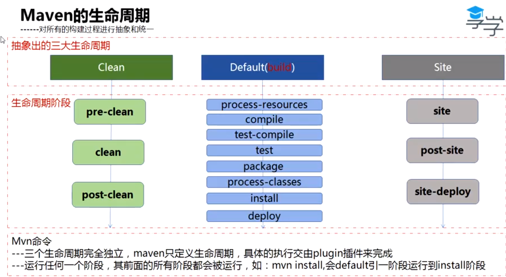
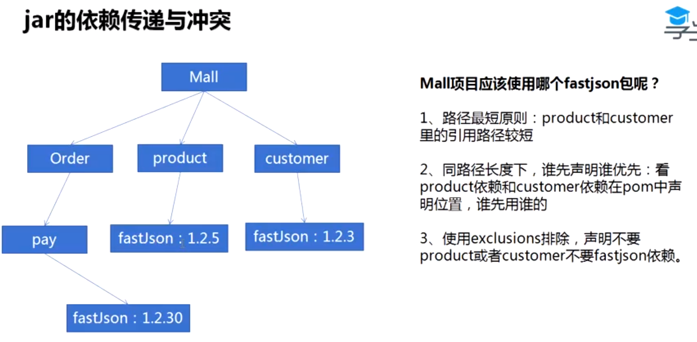

<!--  2019年6月18日20:20:28 享学课堂 Maven 课程 -->

## Maven 的安装

## 配置

主要配置

 ${rootDir}/conf/settings.xml 中的 
 
 <!-- <localRepository>/path/to/your/local/repository</localRepository> -->

阿里云镜像配置

## 打 JAR 包

Maven 打 JAR 包的技术是基于 JDK 中的两个命令 `javac&jar`，JDK 本身就可以打 jar 包

Maven 成功打出 jar 包，需要项目目录遵守它制定的规范，比如，${projectRoot}/src/main/java
Maven 的这种行为，体现了 **约定大于配置** 的思想（Webpack 4 也使用了这种思想）

## Maven 插件

IntelliJ IDEA 中使用 maven architype 初始化项目的过程，就是给 architype 插件传递参数的过程

`mvn archetype:generate -DgroupId=com -DartifactId=learn-maven -DarchetypeArtifactId=maven-archetype-quickstart`

## pom.xml 中 pom 的全称

project object model 项目对象模型

## Maven 生命周期



三大生命周期：clean default（build） site

这三个生命周期各自包含不同的阶段

clean:  pre-clen  clean post-clean

default:  process-resources compile test-compile test package process-classes install deploy

site: site post-site site-deploy

Maven 只是定义了生命周期，具体的执行交给 plugin 来完成，使用了模板方法模式

当我们在命令行输入了 `mvn clean`，maven 实际上执行了两个生命周期阶段 pre-clean 和 clean
当我们在命令行输入了 `mvn compile`，maven 实际上执行了两个生命周期阶段 process-resources 和 compile

### Maven 生命周期和插件相互绑定

多数生命周期阶段都有相应的插件与其绑定，执行到某个阶段，这个阶段包含的插件都会运行，进而执行与之相匹配的任务

生命周期和插件构成了 Maven 这个东西

代码示例：

```xml
<plugin>
  <!-- 这三个属性可以唯一确定一个插件程序 -->
  <groupId></groupId>
  <artifactId></artifactId>
  <version></version>

  <executions>
    <execution>
      <phase>
        clean
      </phase>
      <goals>
        <!-- 执行插件的 log 方法 -->
        <goal>
          log
        <goal>  
      </goals>
    </execution>
  </executions>
</plugin>
```

对于上面的这个配置，如果我们在命令行输入 `mvn compile` 命令的话，上面配置文件中指定的插件的 log 方法并不会执行，因为，配置文件中指定的生命周期阶段是 `clean`

对于以 maven 开头的插件，都是官网实现好的插件，有一点很重要，这些插件都是和特定的生命周期阶段绑定在一起的。

我们自己实现的插件可以绑定挂在生命周期阶段的任意一个阶段，一个插件甚至可以绑定在多个生命周期阶段

## 开发环境和测试环境分开打包的配置

这个技术常见于 mvc 的项目

在 pom.xml 中配置： 

```xml
<profiles>
<profile>
  <properties>
    <package.environment>test</package.environment>
    <db.driver></db.driver>
    <db.url></db.url>
    <db.username></db.username>
    <db.password></db.password>
  </properties>
</profile>

<profile>
  <properties>
    <package.environment>dev</package.environment>
    <db.driver></db.driver>
    <db.url></db.url>
    <db.username></db.username>
    <db.password></db.password>
  </properties>
</profile>
</profiles>
```

接着，结合 maven-resources-plugin 插件的配置才能生效，具体配置省略，可参考

[link](https://ke.qq.com/webcourse/index.html#cid=287404&term_id=100340189&taid=3180002376180396&type=1024&vid=n1431gzy6qp) 时间 1:49:10

## Maven 中 jar 的坐标

如果我们打算把查找 jar 的工作交给计算机，那么每一个 jar 必须拥有唯一的 id 标识

举例：

现实世界中

企业的唯一标识：域名
企业内部项目的唯一标识：项目名称
企业内模块的唯一标识： 模块名


在 Maven 的世界中

需要三个属性来唯一定义一个 jar

1. groupId
2. artifactId
3. version

综上所述，可得出的结论

groupId = 域名 + 项目名
artifactId =  模块名
version = 版本号

## Maven 中的问题

jar 冲突



## Maven 对依赖的管理

```xml
<dependency>
  <groupId></groupId>
  <artifactId></artifactId>
  <version></version>

  // 聚焦于这个配置
  <scope></scope>
</dependency>
```

scope 用于控制被依赖项目对编译、测试、运行时的 classpath 的关系

四个属性值（system 这个选项不要使用）

1. compile（default） 被依赖项目参与编译、测试、运行三个阶段，打包后的文件包含它
2. test 被依赖项目仅仅参与测试相关的工作，如测试代码的编译、执行
3. provided 被依赖项目对运行期无效，打包后的文件不包含它。比如，servlet-api
4. runtime  被依赖项目不需要参与项目的编译，比如：jdbc 驱动

scope 功能的实现

maven 提供了多个 classpath，以供 JVM 的 classloader 使用

## 父子项目的配置文件复用

体现了继承的思想

父项目中的 pom.xml 中的属性值可以被子项目的 pom.xml 继承，而不用重复声明

有一点很重要，这样只是复用了父项目的配置属性值，在打包过程中，仍然是各自打各自的包，没有影响

当然，父项目除外，因为父项目是由子项目组成的（pom.xml中的 `<module></module>`配置也体现了这一点），父项目是没有 `build` 配置项的，父项目的打包方式是 `<packaging>pom</packaging>`

观察到一点，有待思考：子项目配置文件中 `<dependency></dependency>` 中没有 version 项，是为了统一依赖的版本？
