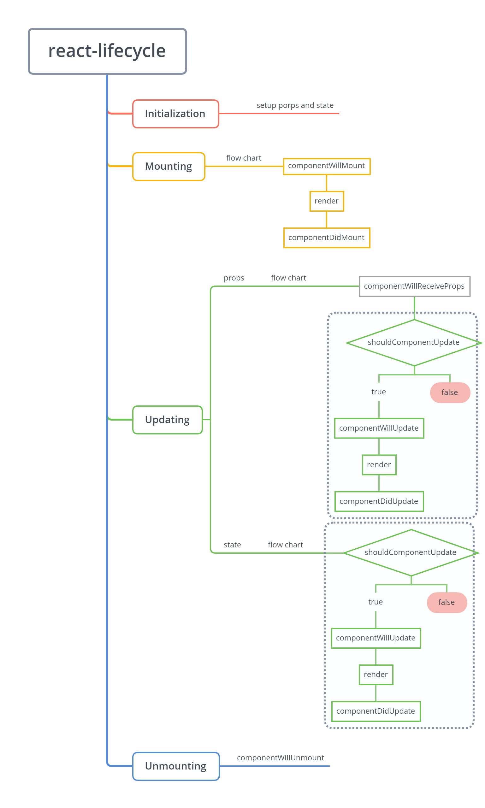

# react lifecycle

## Initialization

对于 `ClassComponent`，其 `constructor()` 方法在组件的初始化阶段执行

## `componentWillReceiveProps`

顶层组件没有这个生命周期函数，因为它没有 `props` 属性

比如，`<TodoList/>` 这个顶层组件，它直接挂载到了根节点 `document.getElementById('root')` 上，自然也就不会有这个生命周期函数。但是，它内嵌的子组件 `<TodoItem/>` 是拥有这个生命周期函数的

---

`componentWillReceiveProps` 执行的时机

一个组件的 `componentWillReveiveProps` 生命周期函数的执行，需要满足两个条件

1. 从父组件接收数据
2. 父组件的 `render()` 方法的执行

条件 2 也可以换句话表述，即

子组件第一次出现在父组件中时，不触发此函数；子组件之后在父组件中的出现才会触发此函数

## `componentWillMount` and `componentDidMount`

这两个生命周期函数**只在组件第一次挂在到页面中时会被触发**，后续 `props、state` 触发的组件更新并不会执行这两个生命周期函数

**记住，`render()` 也是生命周期函数**

## 思考题

react 组件的哪些生命周期函数只会执行一次

`constructor`

`componentWillMount` ajax 请求如果放在这里的话，后期项目如果进行后端同构，会出现问题

`componentDidMount`   ->>   在这里发送 ajax 请求比较合理